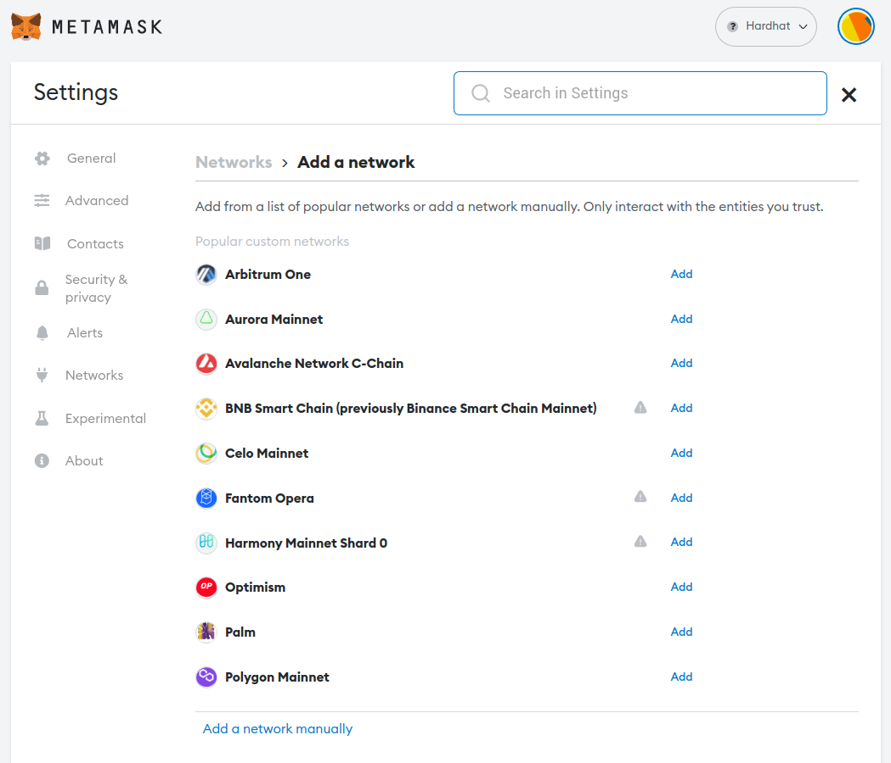

# Adding a Custom Network and Interacting with It Using MetaMask

### Step 1: Install MetaMask Extension

If you haven't installed the MetaMask extension for your browser, visit the MetaMask website (https://metamask.io/) and follow the instructions to install it.

### Step 2: Set Up MetaMask

Open MetaMask by clicking on the extension icon in your browser toolbar. Set up your MetaMask wallet by creating a new account or importing an existing one. Once your wallet is set up, you will see the main MetaMask interface.

### Step 3: Open Network Settings
Click on the network dropdown menu at the top of the MetaMask interface. By default, it should display "Ethereum Network" or "Goerli Network". Click on "Custom RPC" at the bottom of the network list to open the network settings.
  
 

And then select the Networks tab and the Networks' listing will show up.

 

### Step 4: Add Custom Network
In the network settings, you will see a form to add a custom network. Fill in the following details:

Network Name: Enter a name for your custom network (e.g., "Hardhat").
New RPC URL: Enter the URL of the custom network you want to connect to which is `http://localhost:8545`.
Chain ID: Enter the chain ID associated with the custom network, `1337`.
Once you have filled in the details, click on the "Save" button.

Here is the above process in images.

 

 

Here are the ifnormation required to setup the custom Hardhat network to spin up the simulator:

 


### Step 5: Switch to Custom Network
After adding the custom network, it will appear in the network dropdown menu. Select your custom network from the list to switch to it.

 

### Step 6: Create/Import an Account
Once the docker-compose has already spun up the containers, then you should pick the private key from one of the accounts which are preloaded with test ETH in order to 
execute transactions (these accounts are available from the Hardhat node) and import it into the Metamask. More about the rewards assigned to each account can be found in [simulate script](https://github.com/WeatherXM/smart-contracts-simulator/blob/main/scripts/simulate.ts).

```
[
    {
        'public':'0x3C44CdDdB6a900fa2b585dd299e03d12FA4293BC',
        'private':'0x5de4111afa1a4b94908f83103eb1f1706367c2e68ca870fc3fb9a804cdab365a'
        'rewards':100.0
    },
    {
        'public':'0x90F79bf6EB2c4f870365E785982E1f101E93b906',
        'private':'0x7c852118294e51e653712a81e05800f419141751be58f605c371e15141b007a6'
        'rewards':60.0
    },
    {
        'public':'0x15d34AAf54267DB7D7c367839AAf71A00a2C6A65',
        'private':'0x47e179ec197488593b187f80a00eb0da91f1b9d0b13f8733639f19c30a34926a'
        'rewards':48.3
    },
    {
        'public':'0x9965507D1a55bcC2695C58ba16FB37d819B0A4dc',
        'private':'0x8b3a350cf5c34c9194ca85829a2df0ec3153be0318b5e2d3348e872092edffba'
        'rewards':30.0
    },
    ...
]

```

The following images describe the steps that you should follow to  import the account.

 

 

 
 
 

### Step 7: Interacting with the Custom Network
Now that you are connected to your custom network, you can interact with it just like you would with the main Ethereum network. You can view your account balance, send transactions, and interact with the decentralized application of Smart Contracts Simulator on the custom network.


That's it! You have successfully added a custom network and are ready to interact with the Smart Contract Simulator using the already imported account in MetaMask.

