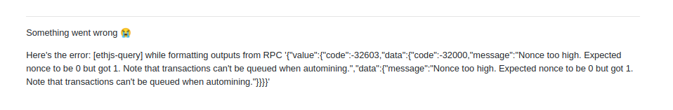
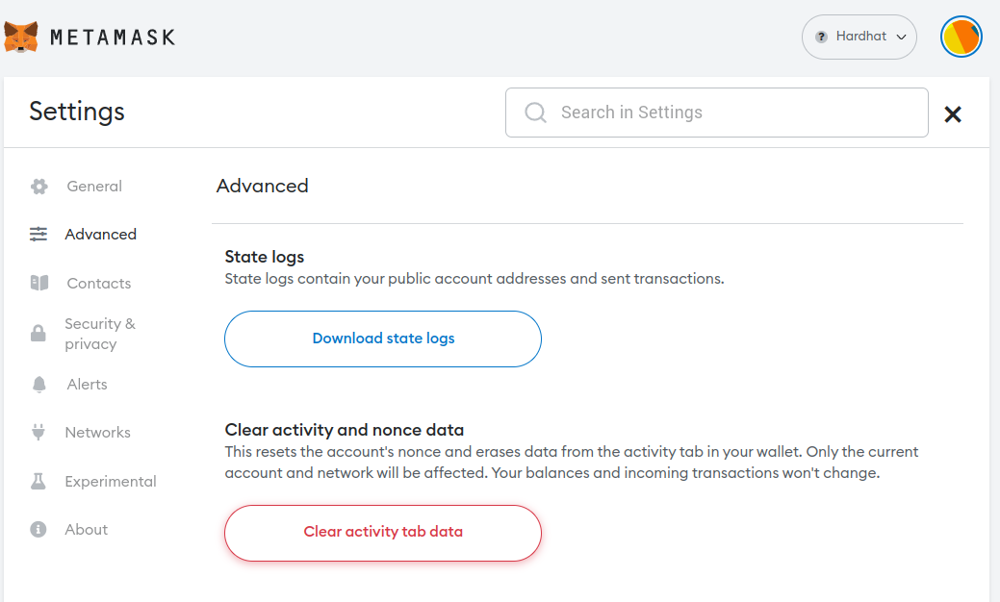

# Troubleshooting

Every time the docker compose is restarted and the containers are spun up, then in case you have already imported an account into the Metamask and the execution of new transactions is already initiated, you will come across the following error message:

 

The above error can be solved by clearing the activity data already stored in Metamask for a specific (imported) account.

 

